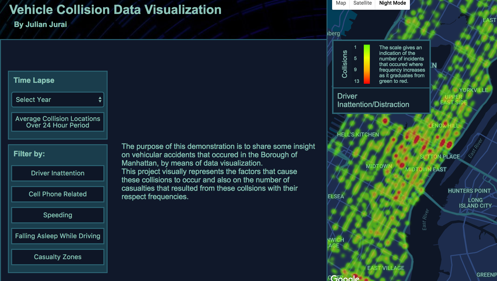

# Visualization of vehicular collisions in Manhattan

 [LIVE](https://julian-jurai.github.io/vehicle-collisions-data-visualization/)

### Background

As of recently the city's OpenData portal began publishing data that was once difficult to analyze. Over the past 2 years there has been over 100,000 collisions in NYC alone.
This project involves utilizing data provided by the NYPD to give some insight on the frequency, location and causation of these collisions.

### Features  

With this app, users will be able to:
- [ ] Identify locations where accidents have occured and the frequency at which they occur
- [ ] Differentiate between causations
- [ ] Identify areas where casualties have occured in the past
- [ ] Visualize the frequency of the collisions

### Getting Started

On the left hand side of the screen there is a series of buttons allowing the user to experience the data representation based on various factors. The there are two main modes: a static representation and a dynamic representation, where the data changes over a time frame specified by the control activated.
The different controls are:

#### Time Lapse
- [ ] Select Year - displays a time lapse of the the total number of accidents that occur per month for the selected year. This also brings up a graph which shows the how the total number of collisions changes from 2012 to 2016
- [ ] Average Collision locations Over 24 Hour Period - displays a time lapse showing the total number of accidents that occur from 2012 to 2016, at each hour of the day. This option also brings up a graph which shows the relationship between the number of collisions and the time of day

#### Filter By
- [ ] Driver Inattention - shows the accidents caused due to driver distraction
- [ ] Cell Phone Related - shows the number of cell phone related accidents
- [ ] Speeding - shows the number of accidents caused by drivers traveling at unsafe speeds
- [ ] Falling Asleep While Driving - shows the number of accidents caused by drivers falling asleep while driving
- [ ] Casualty Zones - highlights the areas where human casualties have occurred.
- [ ] Each option causes a graph to be displayed which shows the relationship between the number of accidents and the respective cause

### Screenshot

### Technologies

This project will be implemented with the following technologies:

- `JavaScript` for logic,
- `D3.js` with `HTML5` for effects rendering,
- `Google Maps API` with `Google Visualization API` for effects rendering,
