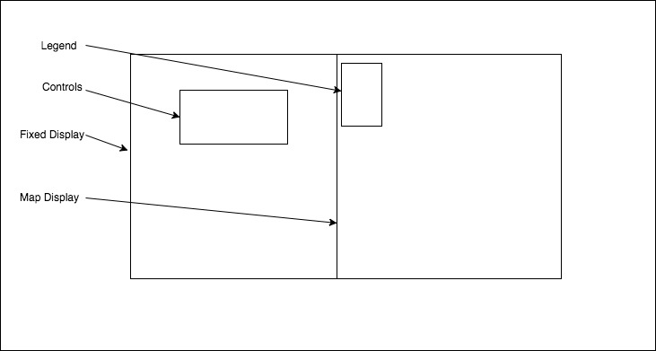

## Visualization of vehicular collisions in Manhattan

### Background

As of recently the city's OpenData portal began publishing data that was once difficult to analyze. Over the past 2 years there has been over 100,000 collisions in NYC alone.
This project involves utilizing data provided by the NYPD to give some insight on the frequency, location and causation of these collisions.

### Functionality & MVP  

With this app, users will be able to:

- [ ] Identify locations where accidents have occured
- [ ] Differentiate between causations
- [ ] Visualize the frequency of the collisions

In addition, this project will include:

- [ ] A production README

### Architecture and Technologies

This project will be implemented with the following technologies:

- `JavaScript` for logic,
- `D3.js` with `HTML5 Baz` for effects rendering,
- `webpack` to bundle js files.

### Wireframe

### Implementation Timeline

**Day 1**:
 Set up project directory, obtain dataset and filter as necessary, research on D3.js implementation with google Maps API.

**Day 2**:
  Have a functioning map that displays relevant information from the dataset and complete styling

**Day 3**:
  Implement selector to toggle between data being displayed
